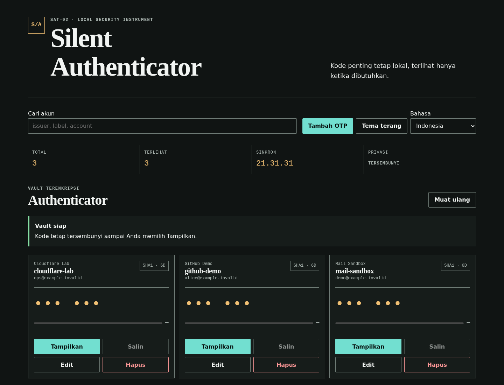
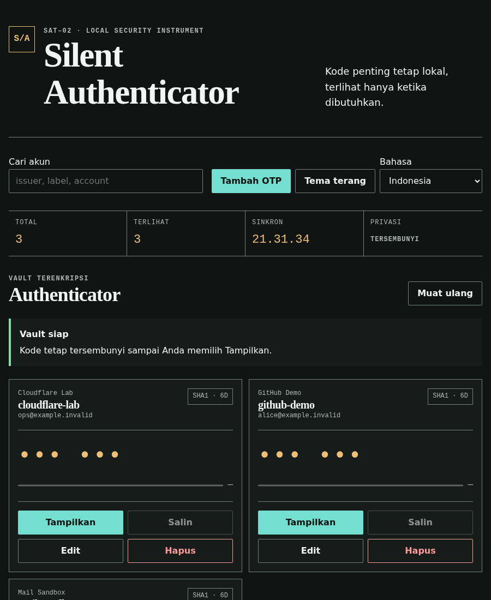
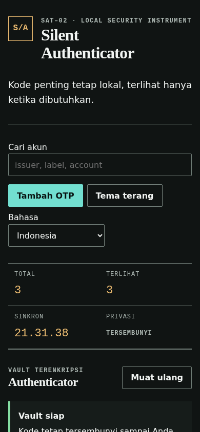

# SAT — Silent Authenticator Tool

[](https://github.com/Silent-Protocol-Inc/Silent-Authenticator/stargazers)
[](https://github.com/Silent-Protocol-Inc/Silent-Authenticator/commits/main)
[](https://github.com/Silent-Protocol-Inc/Silent-Authenticator)
[](LICENSE)

SAT is a local-first TOTP manager with an encrypted OpenSSL vault, a Bash CLI, and an optional Python web interface. Version 2.1.0 keeps the legacy `otp.vault` encryption format while separating vault policy, CLI commands, HTTP transport, and browser assets.

## Requirements

Install Bash, OpenSSL, jq, Python 3, `flock`, zip, and unzip. QR scanning additionally uses `zbarimg`; clipboard support is optional.

From the repository root, create a global launcher symlink with `sudo ln -s "$PWD/bin/sat" /usr/local/bin/sat`. The launcher resolves the repository location from its real path, or from `SAT_PROJECT_ROOT` when an explicit checkout path is needed.

```bash
chmod +x sat.sh
./sat.sh doctor
./sat.sh init
./sat.sh add github-main
./sat.sh code github-main --clip
./sat.sh list
```

Secrets are prompted without terminal echo. For automation, provide the master password through an inherited descriptor:

```bash
SAT_MASTER_PASS_FD=3 ./sat.sh list --json 3<<<'development-only-password'
```

Use a disposable runtime while testing:

```bash
SAT_HOME=/tmp/sat-dev ./sat.sh init
```

## Backup and Restore

`./sat.sh backup my-vault` creates and verifies an encrypted ZIP without deleting the local vault. `portable` is a safe alias for `backup`. Use `./sat.sh move my-vault` only when the verified backup should be followed by local vault deletion. Restore with `./sat.sh restore my-vault.zip --yes`.

## Web UI

```bash
./sat.sh web-start --host 127.0.0.1 --port 8787
./sat.sh web-status
./sat.sh web-stop
```

`web-start` meminta master password melalui prompt lokal dan baru berhasil setelah endpoint `/health` siap. Buka URL yang dicetak oleh `web-start` atau `web-status`. Jika port sedang dipakai, pilih port lain, misalnya `./sat.sh web-start --port 8788`. Gunakan `./sat.sh web` hanya bila server perlu tetap berjalan di foreground.

For the previous direct-from-VPS workflow, run `sat web-public`. It asks for the master password and a separate Web UI token, binds to the network, and prints the detected VPS URL. Enter that token in the browser access gate. The token stays out of argv, URLs, logs, environment values, and browser storage.

Untuk domain atau subdomain, pilih `Website` lalu `Domain / subdomain` dari menu, atau gunakan CLI berikut:

```bash
./sat.sh web-domain sat.example.com --cloudflare off
./sat.sh web-domain sat.example.com --cloudflare dns-only
./sat.sh web-domain sat.example.com --cloudflare proxied
```

`off` berarti DNS dikelola di luar Cloudflare, `dns-only` berarti Cloudflare tanpa proxy (grey cloud), dan `proxied` berarti orange cloud. Arahkan record A/AAAA hostname tersebut ke IP publik VPS. Mode proxied memakai port HTTP `8080` secara default; SAT juga menerima 8880, 2052, 2082, 2086, dan 2095. Port 80 sengaja tidak dipakai karena SAT mempertahankan rentang port non-privileged 1024–65535. SAT hanya menyimpan metadata deployment lokal dan tidak mengubah DNS provider.

Kontrak error khusus mode domain:

| Machine code | Exit | Arti / tindakan |
| --- | ---: | --- |
| `domain_host_conflict` | 2 | Jangan gabungkan `--domain` dengan `--host`; SAT memilih bind jaringan untuk mode domain. |
| `invalid_domain` | 6 | Gunakan hostname DNS penuh seperti `sat.example.com`. |
| `invalid_cloudflare_mode` | 6 | Pilih `off`, `dns-only`, atau `proxied`. |
| `cloudflare_port_unsupported` | 6 | Pilih salah satu port HTTP Cloudflare yang didukung SAT. |

Localhost can run without a web token. Any non-local bind—including domain mode—requires `SAT_WEB_TOKEN_FD`; the token is kept in process/tab memory and is never accepted in a URL or normal command argument. SAT does not provide TLS. Put a trusted TLS reverse proxy in front of it before any remote use. Cloudflare proxy status alone does not add TLS to the SAT origin.

## Web UI Preview

The screenshots below were captured with Google Chrome against a disposable vault containing synthetic `.invalid` accounts. No production vault or OTP material is shown.

| Desktop | Tablet | Mobile |
| --- | --- | --- |
|  |  |  |

## Verification

```bash
bash -n sat.sh lib/*.sh
shellcheck -x sat.sh
python3 -m py_compile lib/totp.py web/server.py
./tests/integration.sh
./tests/load_400.sh
python3 tests/test_totp.py
python3 tests/verify_design.py
```

See [docs/SECURITY.md](docs/SECURITY.md), [docs/DESIGN.md](docs/DESIGN.md), and [docs/MIGRATION_V2.md](docs/MIGRATION_V2.md) for the operating contracts and known limitations.

## License

Copyright 2026 Silent Protocol Inc. Licensed under the [Apache License 2.0](LICENSE).
